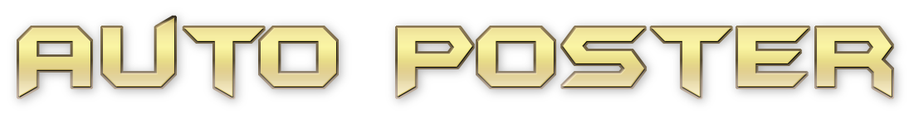

<!-- Improved compatibility of back to top link: See: https://github.com/othneildrew/Best-README-Template/pull/73 -->
<a name="readme-top"></a>
[![Contributors][contributors-shield]][contributors-url]
[![Forks][forks-shield]][forks-url]
[![Stargazers][stars-shield]][stars-url]
[![Issues][issues-shield]][issues-url]
[![MIT License][license-shield]][license-url]
[![LinkedIn][linkedin-shield]][linkedin-url]


<!-- PROJECT LOGO -->
<br />
<div align="center">
  <a href="https://github.com/coderaman7/Auto-Poster">
    
  </a>

<h3 align="center">Auto Poster</h3>

  <p align="center">
    A Cross-platform Desktop App developed to post Updates on over every social media platform to minimize your un-productive social media usage.
    <br />
    <a href="https://github.com/coderaman7/Auto-Poster/wiki"><strong>Explore the docs »</strong></a>
    <br />
    <br />
    <a href="https://github.com/coderaman7/Auto-Poster">View Demo</a>
    ·
    <a href="https://github.com/coderaman7/Auto-Poster/issues">Report Bug</a>
    ·
    <a href="https://github.com/coderaman7/Auto-Poster/issues">Request Feature</a>
  </p>
</div>


<!-- TABLE OF CONTENTS -->
<details>
  <summary>Table of Contents</summary>
  <ol>
    <li>
      <a href="#about-the-project">About The Project</a>
      <ul>
        <li><a href="#built-with">Built With</a></li>
      </ul>
    </li>
    <li>
      <a href="#getting-started">Getting Started</a>
      <ul>
        <li><a href="#prerequisites">Prerequisites</a></li>
        <li><a href="#installation">Installation</a></li>
      </ul>
    </li>
    <li><a href="#usage">Usage</a></li>
    <li><a href="#roadmap">Roadmap</a></li>
    <li><a href="#contributing">Contributing</a></li>
    <li><a href="#license">License</a></li>
    <li><a href="#contact">Contact</a></li>
    <li><a href="#acknowledgments">Acknowledgments</a></li>
  </ol>
</details>


<!-- ABOUT THE PROJECT -->
## About The Project

[![Product Name Screen Shot][product-screenshot]](./images/demo.png)

<p align="right">(<a href="#readme-top">back to top</a>)</p>


### Built With

 * [![Python][Python]][Python-url] 
 * [![Selenium][Selenium]][Selenium-url] 
 * [![PRAW][PRAW]][PRAW-url] 
 * [![Tweepy][Tweepy]][Tweepy-url]

<p align="right">(<a href="#readme-top">back to top</a>)</p>


<!-- GETTING STARTED -->
## Getting Started

This is an example of how you may give instructions on setting up your project locally.
To get a local copy up and running follow these simple example steps.

### Prerequisites

All these dependencies which are required are listed below to start the Installation of this software
* `git`
* `Python`

after these two are installed then make sure pip is installed or not by running this command  

 - ````pip```` and then hit enter

### Installation

- *Though it is recommended to use virtualenv and create a shell script for Linux/Mac or edit the main.bat file accordingly in Windows*  
- *This software is made with precaution to install the dependency if not already available*

1. Clone the repo
   ```sh
   git clone https://github.com/coderaman7/Auto-Poster.git
   ```
3. Install the dependencies
   ```sh
   pip install -r requirements.txt 
   ```
4. API key management is available inside the application so use the `App Management section`

<p align="right">(<a href="#readme-top">back to top</a>)</p>


<!-- USAGE EXAMPLES -->
## Usage

This Software is developed to minimize our un-productive social media usage by us. Now to post any kind of update on the Social Media all we have to do is open this write the post and select the social media onto which we want to update and click Post, and you're done posting on several social media platforms._

<p align="right">(<a href="#readme-top">back to top</a>)</p>


<!-- ROADMAP -->
## Roadmap

- [ ] Twitter
  - [x] Post on Twitter without elevated access
  - [x] Upload Images in a tweet without a v2 endpoint ( which requires elevated Access ).
  - [ ] Delete a Tweet ( selective using option Box )
  - [ ] Delete a Post based on Likes and Comments
- [ ] Reddit
  - [x] Post onto Subreddits
  - [x] keep a list of banned subreddits and Not able to Post on Sub Reddit
  - [ ] Delete a Post using manual selection
  - [x] Delete a Post based on Upvotes and Comments
  - [x] Download Saved Vids
- [ ] Instagram
    - [x] Hidden Under Inside Testing Mode Option
    - [ ] Upload Images
- [x] Discord
  - [x] Send Messages on a selected Discord Channel
  - [x] Upload Images on a Selected Discord Channel
- [ ] Facebook
  - [ ] Still to Implement but right now focusing on Instagram
- [x] Koo
  - [x] No Users in currently subscribed People on [Projekt Notifier](https://projektnotify.vercel.app)
- [x] Pinterest
  - [x] No Users in currently subscribed People on [Projekt Notifier](https://projektnotify.vercel.app)
- [x] YouTube
  - [x] This bot can lead to low user interaction for any creator
- [x] Tumblr
  - [x] In future Update after Instagram
- [x] Telegram
  - [x] Telegram can be a bit difficult for users to set up. But will be available on Request

See the [open issues](https://github.com/coderaman7/Auto-Poster/issues) for a full list of proposed features (and known issues).

<p align="right">(<a href="#readme-top">back to top</a>)</p>


<!-- CONTRIBUTING -->
## Contributing

Contributions are what makes the open source community such an amazing place to learn, inspire, and create. Any contributions you make are **greatly appreciated**.

If you have a suggestion that would make this better, please fork the repo and create a pull request. You can also simply open an issue with the tag "enhancement".
Don't forget to give the project a star! Thanks again!

1. Fork the Project
2. Create your Feature Branch (`git checkout -b feature/AmazingFeature`)
3. Commit your changes (`git commit -m 'Add some AmazingFeature'`)
4. Push to the Branch (`git push origin feature/AmazingFeature`)
5. Open a Pull Request

<p align="right">(<a href="#readme-top">back to top</a>)</p>


<!-- LICENSE -->
## License

Distributed under the MIT License. See `LICENSE` for more information.

<p align="right">(<a href="#readme-top">back to top</a>)</p>


<!-- CONTACT -->
## Contact

Your Name - Aman  
Twitter - [@BugsOverflow](https://twitter.com/BugsOverflow)  
Email - bugsoverflow@gmail.com

Project Link: [https://github.com/coderaman7/Auto-Poster](https://github.com/coderaman7/Auto-Poster)

<p align="right">(<a href="#readme-top">back to top</a>)</p>


<!-- MARKDOWN LINKS & IMAGES -->
<!-- https://www.markdownguide.org/basic-syntax/#reference-style-links -->
[contributors-shield]: https://img.shields.io/github/contributors/coderaman7/Auto-Poster.svg?style=for-the-badge
[contributors-url]: https://github.com/coderaman7/Auto-Poster/graphs/contributors
[forks-shield]: https://img.shields.io/github/forks/coderaman7/Auto-Poster.svg?style=for-the-badge
[forks-url]: https://github.com/coderaman7/Auto-Poster/network/members
[stars-shield]: https://img.shields.io/github/stars/coderaman7/Auto-Poster.svg?style=for-the-badge
[stars-url]: https://github.com/coderaman7/Auto-Poster/stargazers
[issues-shield]: https://img.shields.io/github/issues/coderaman7/Auto-Poster.svg?style=for-the-badge
[issues-url]: https://github.com/coderaman7/Auto-Poster/issues
[license-shield]: https://img.shields.io/github/license/coderaman7/Auto-Poster.svg?style=for-the-badge
[license-url]: https://github.com/coderaman7/Auto-Poster/blob/master/LICENSE.txt
[linkedin-shield]: https://img.shields.io/badge/-LinkedIn-black.svg?style=for-the-badge&logo=linkedin&colorB=555
[linkedin-url]: https://linkedin.com/in/coderaman7
[product-screenshot]: images/demo.png
[Python]: https://img.shields.io/badge/-Python-red
[Python-url]: https://python.org/
[Selenium]: https://img.shields.io/badge/-Selenium-brightgreen
[Selenium-url]: https://www.selenium.dev/
[Tweepy]: https://img.shields.io/badge/-Tweepy-yellowgreen
[Tweepy-url]: https://docs.tweepy.org/en/stable/
[PRAW]: https://img.shields.io/badge/-PRAW-lightgrey
[PRAW-url]: https://praw.readthedocs.io/en/stable/


ToDo
Make a damn good Documentation for this
No Image Upload in Discord